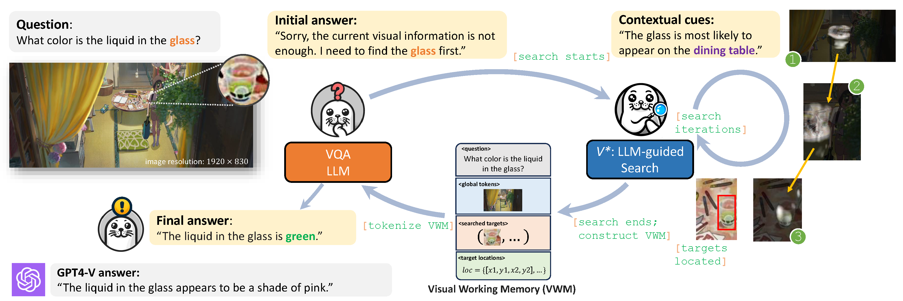

# *V*\*: Guided Visual Search as a Core Mechanism in Multimodal LLMs

### [Paper]() | [Project Page]()





This repo contains PyTorch model definitions, pre-trained weights and training/sampling code for our paper exploring 
diffusion models with transformers (DiTs). You can find more visualizations on our [project page](https://www.wpeebles.com/DiT).


## Contents:
1. [Getting Started](#start)
4. [Demo](#models)
5. [Benchmark](#todos)
6. [Evaluation](#models)
7. [Training](#todos)
10. [License](#license)
11. [Citation](#citation)

## Getting Started <a name="start"></a>

### Installation
```
conda create -n vstar python=3.10 -y
conda activate vstar
pip install -r requirements.txt
pip install flash-attn --no-build-isolation
```

### Pre-trained Model

The vqa llm in our Seal framework can be downloaded [here](https://huggingface.co/craigwu/seal_vqa_7b).  
The visual search model in our seal framework can be downloaded [here](https://huggingface.co/craigwu/seal_vsm_7b).

### Training Dataset

The alignment stage of the vqa llm needs 

The instruction tuning stage requires the of our 

## Demo
You can launch a local Gradio demo after the installation by running `python app.py`. Note that the pre-trained model weights will be automatically downloaded if you have not downloaded them before.

You are expected to see the web page below:

## Benchmark
Our *V*\*Bench is available [here](https://huggingface.co/datasets/craigwu/vstar_bench). 
The benchmark contains folders for different subtasks. Within each folder is a list of image files and annotation JSON files. The image and annotations files are paired according to the filename. The format of the annotation files is:
```json
{
  "target_object": [] // A list of target object names
  ,
  "bbox": [] // A list of target object coordinates in <x,y,w,h>
  ,
  "question": "",
  "options": [] // A list of options, the first one is the correct option by default
}
