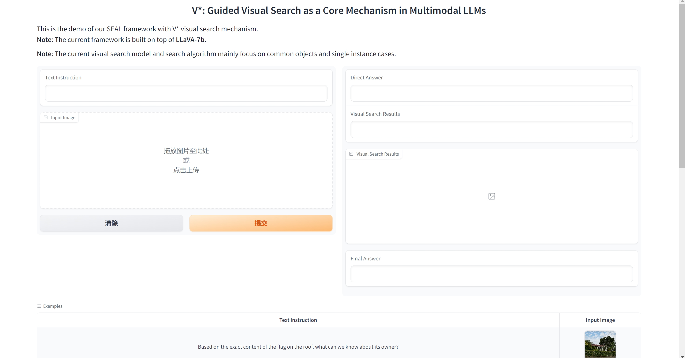

# *V*\*: Guided Visual Search as a Core Mechanism in Multimodal LLMs

### [Paper](https://arxiv.org/abs/2312.14135) | [Project Page](https://vstar-seal.github.io/) | [Online Demo](https://huggingface.co/spaces/craigwu/vstar)


## Contents:
1. [Getting Started](#start)
2. [Demo](#demo)
3. [Benchmark](#benchmark)
4. [Evaluation](#evaluation)
5. [Training](#training)
6. [License](#license)
7. [Citation](#citation)
8. [Acknowledgement](#acknowledgement)

## Getting Started <a name="start"></a>

### Installation
```
conda create -n vstar python=3.10 -y
conda activate vstar
pip install -r requirements.txt
pip install flash-attn --no-build-isolation
export PYTHONPATH=$PYTHONPATH:path_to_vstar_repo
```

### Pre-trained Model

The VQA LLM can be downloaded [here](https://huggingface.co/craigwu/seal_vqa_7b).  
The visual search model can be downloaded [here](https://huggingface.co/craigwu/seal_vsm_7b).

### Training Dataset

The alignment stage of the VQA LLM uses the 558K subset of the LAION-CC-SBU dataset used by LLaVA which can be downloaded [here](https://huggingface.co/datasets/liuhaotian/LLaVA-Pretrain).

The instruction tuning stage requires several instruction tuning subsets which can be found [here](https://huggingface.co/datasets/craigwu/seal_vqa_data).

The instruction tuning data requires images from [COCO-2014](http://images.cocodataset.org/zips/train2014.zip), [COCO-2017](http://images.cocodataset.org/zips/train2017.zip), and [GQA](https://downloads.cs.stanford.edu/nlp/data/gqa/images.zip). After downloading them, organize the data following the structure below
```
├── coco2014
│   └── train2014
├── coco2017
│   └── train2017
└── gqa
     └── images
```

## Demo <a name="demo"></a>
You can launch a local Gradio demo after the installation by running `python app.py`. Note that the pre-trained model weights will be automatically downloaded if you have not downloaded them before.

You are expected to see the web page below:



## Benchmark <a name="benchmark"></a>
Our *V*\*Bench is available [here](https://huggingface.co/datasets/craigwu/vstar_bench). 
The benchmark contains folders for different subtasks. Within each folder is a list of image files and annotation JSON files. The image and annotations files are paired according to the filename. The format of the annotation files is:
```javascript
{
  "target_object": [] // A list of target object names
  ,
  "bbox": [] // A list of target object coordinates in <x,y,w,h>
  ,
  "question": "",
  "options": [] // A list of options, the first one is the correct option by default
}
```
## Evaluation <a name="evaluation"></a>

To evaluate our model on the *V*\*Bench benchmark, run
```
python vstar_bench_eval.py --benchmark-folder PATH_TO_BENCHMARK_FOLDER
```

To evaluate our visual search mechanism on the annotated targets from the *V*\*Bench benchmark, run
```
python visual_search.py --benchmark-folder PATH_TO_BENCHMARK_FOLDER
```
The detailed evaluation results of our model can be found [here](https://drive.google.com/file/d/1jl4jStTmizVXrKi2ogvOmFB8Zuj0ffj6/view?usp=sharing).  

## Training <a name="training"></a>

The training of the VQA LLM model includes two stages.

For the pre-training stage, enter the LLaVA folder and run
```
sh pretrain.sh
```

For the instruction tuning stage, enter the LLaVA folder and run
```
sh finetune.sh
```

For the training data preparation and training procedures of our visual search model, please check this [doc](./VisualSearch/training.md).

## License <a name="license"></a>

This project is under the MIT license. See [LICENSE](LICENSE) for details.

## Citation <a name="citation"></a>
Please consider citing our paper if you find this project helpful for your research:

```bibtex
@article{vstar,
  title={V*: Guided Visual Search as a Core Mechanism in Multimodal LLMs},
  author={Penghao Wu and Saining Xie},
  journal={arXiv preprint arXiv:2312.14135},
  year={2023}
}
```

## Acknowledgement <a name="acknowledgement"></a>
-  This work is built upon the [LLaVA](https://github.com/haotian-liu/LLaVA) and [LISA](https://github.com/dvlab-research/LISA). 
